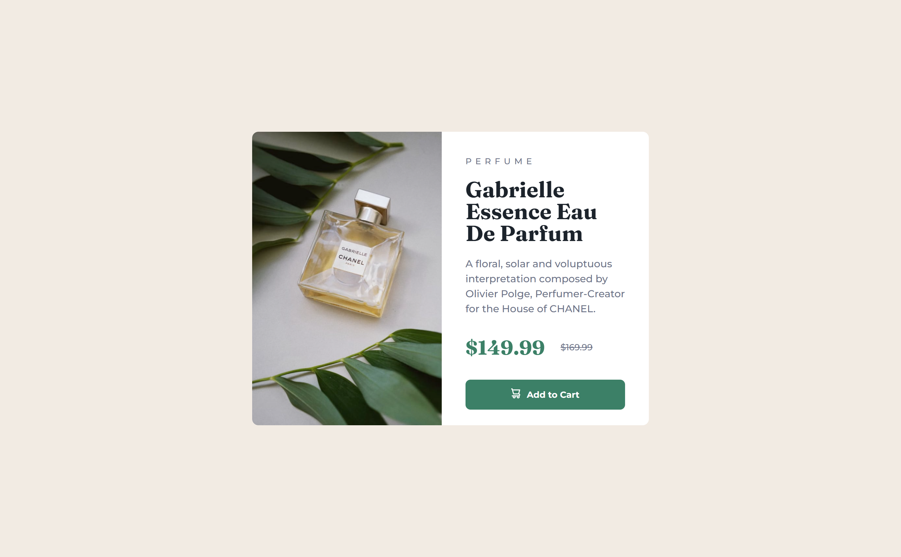

# 💻 Frontend Mentor - Product preview card component

### Olá! 🌞

### Guia de conteúdo:

- [Visão geral](#visao-geral)
- [Processo](#processo)
  - [Tecnologias usadas](#tecnologias)
  - [O que aprendi](#o-que-aprendi)

### Visão geral
O projeto do front-end mentor é simples e pede a construção de um card de produto, conforme prévias desktop e mobile fornecidas pelo site.

### Processo
O desafio pertence à categoria "newbie", por isso o processo também se deu de maneira simples. Eu já havia tido contato com tudo o que foi necessário para finalizá-lo e aqui mudei pouca coisa em relação ao desafio anterior.

### Tecnologias
- HTML
- CSS

### O que aprendi
Não exatamente um aprendizado, mas usei novamente a tag HTML "picture" para alternar as duas imagens disponibilizadas para mobile e desktop, além de substituir o uso da unidade de medida "px" por "rem".

### Meus perfis
   - [Front-end Mentor](https://www.frontendmentor.io/profile/instmi)
   - [Twitter](https://twitter.com/instmi_studies)
   - [LinkedIn](https://www.linkedin.com/in/milenaoandrade/)